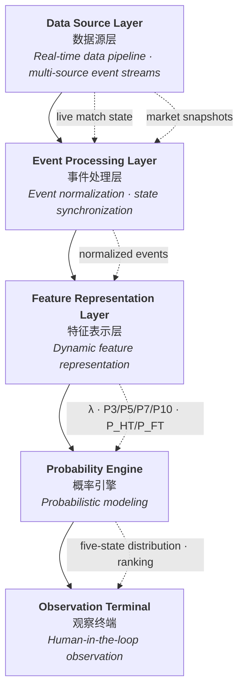
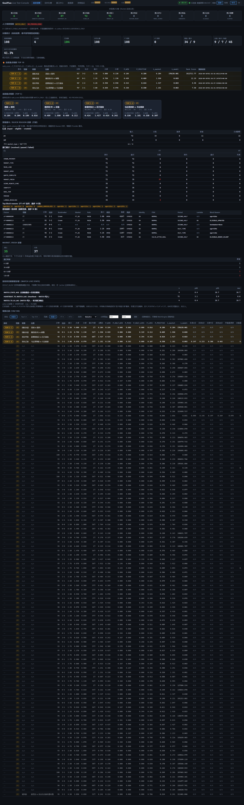
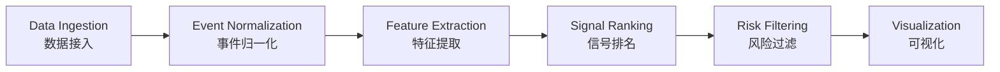
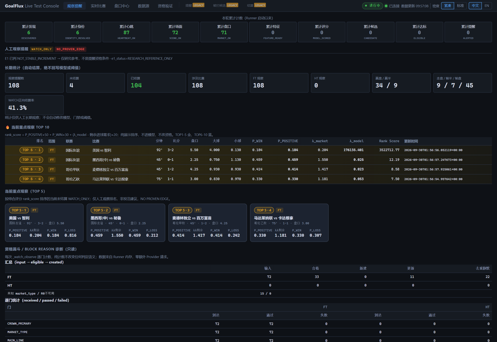
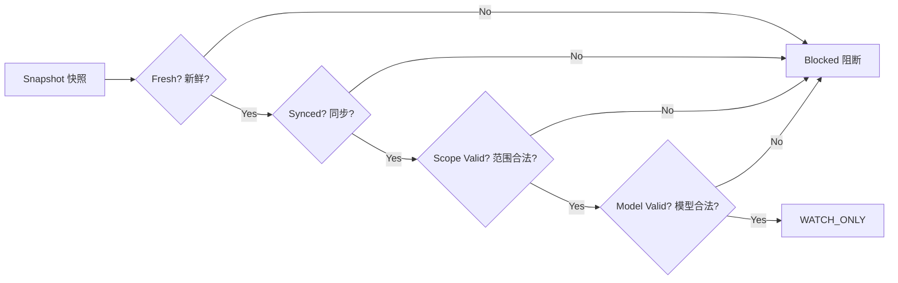
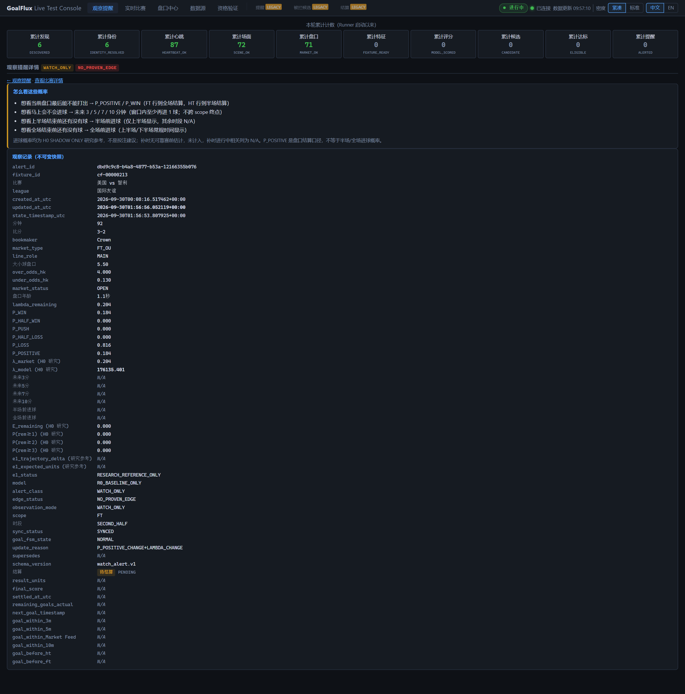
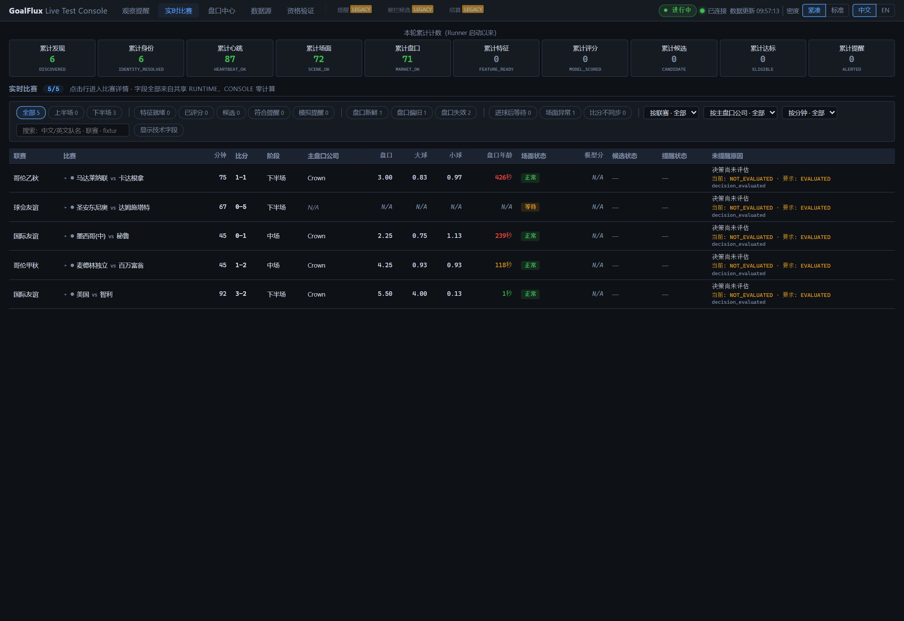
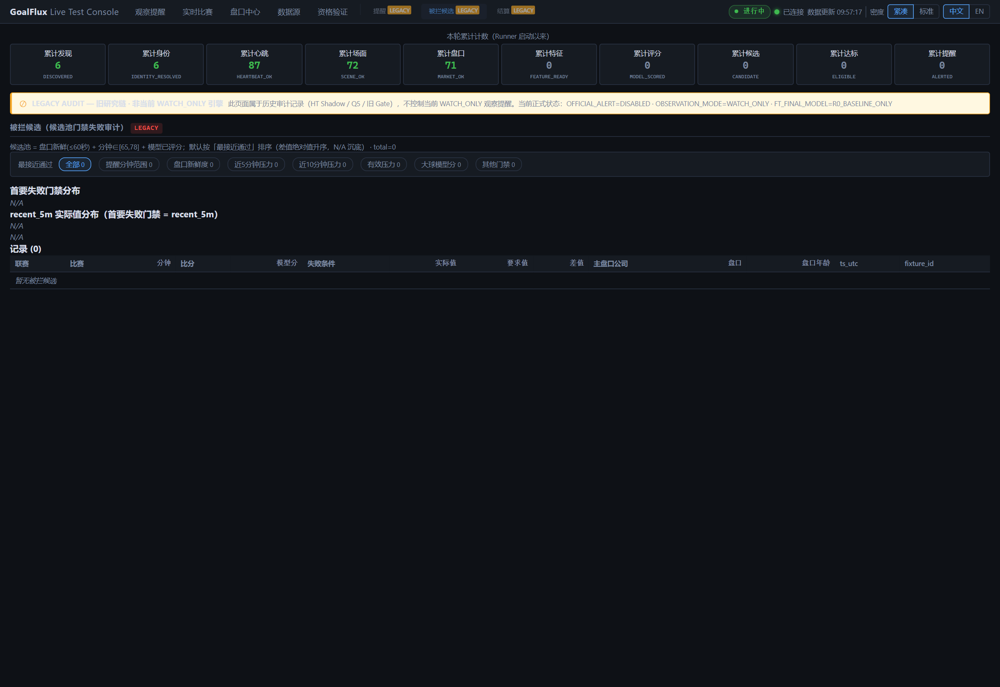

<p align="center">
  
</p>

<h1 align="center">GoalFlux</h1>

<p align="center">
  <b>Live Football Intelligence Terminal</b><br/>
  实时足球智能终端
</p>

<p align="center">
  <b>Real-time Event Fusion</b> · <b>Temporal State Modeling</b> · <b>Probabilistic Intelligence Engine</b> · <b>Explainable Observation Framework</b><br/>
  多源事件融合 · 时序状态建模 · 概率表示 · 风险约束观察
</p>

<p align="center">
  Created by <b>随心笔记</b>
</p>

<p align="center">
  
  
  
  
  
  
</p>

---

## 目录 / Table of Contents

- [架构管线 / Architecture Pipeline](#架构管线--architecture-pipeline)
- [Dashboard Preview](#dashboard-preview)
- [项目概述 / Project Overview](#项目概述--project-overview)
- [核心能力 / Key Capabilities](#核心能力--key-capabilities)
- [核心模块 / Core Modules](#核心模块--core-modules)
- [技术基础 / Technical Foundation](#技术基础--technical-foundation)
- [剩余进球引擎 / Remaining Goals Engine](#剩余进球引擎--remaining-goals-engine)
- [Asian Total 结算逻辑 / Settlement Logic](#asian-total-结算逻辑--settlement-logic)
- [概率语义 / Probability Semantics](#概率语义--probability-semantics)
- [WATCH_ONLY 观察模式 / Watch-Only](#watch_only-观察模式--watch-only)
- [Top 排名 / Ranking](#top-排名--ranking)
- [FT / HT 独立设计](#ft--ht-独立设计)
- [安全设计 / Fail-Closed Safety](#安全设计--fail-closed-safety)
- [页面截图 / Screenshots](#页面截图--screenshots)
- [技术原则 / Technical Principles](#技术原则--technical-principles)
- [项目状态 / Project Status](#项目状态--project-status)
- [Roadmap](#roadmap)
- [作者 / Author](#作者--author)
- [免责声明 / Disclaimer](#免责声明--disclaimer)
- [许可 / License](#许可--license)

---

## 架构管线 / Architecture Pipeline

GoalFlux 采用五层实时管线，从多源事件流到人工观察终端形成完整数据链：



- **Real-time data pipeline**：多源事件流接入与原始事件采集（identity / state / market）
- **Event normalization**：跨源事件归一化、身份校验、比分与分钟同步
- **Dynamic feature representation**：剩余进球 λ、Poisson 分布、P3/P5/P7/P10、P_HT/P_FT 动态特征
- **Probabilistic modeling**：五态结算概率、短期进球概率、综合评分
- **Human-in-the-loop observation**：WATCH_ONLY 观察终端、Top 排名、诊断面板与人工判定

> 公开版本统一使用 `Live Match Stream` / `Primary Asian Total Market` / `Market Provider` 等中性名称，不出现真实数据供应商、接口地址与采集实现。

---

## Dashboard Preview

<p align="center">
  
</p>

<p align="center"><sub>GoalFlux Intelligence Terminal · Real-time Watch Dashboard · PUBLIC DEMO MODE</sub></p>

---

## 项目概述 / Project Overview

**中文**

GoalFlux 是一个面向实时足球场景的**多源数据融合与智能分析研究框架**。

系统将实时比赛状态、亚洲大小球市场、剩余进球分布与五态结算模型组织为统一数据链，为 FT（全场）/ HT（半场）场景提供 WATCH_ONLY 人工观察终端。

GoalFlux 基于现代实时智能系统设计理念，构建多源事件融合、时序状态建模、概率分析与可解释观察的一体化研究框架。

> GoalFlux 当前定位为 **Research / Intelligence Framework**。
> 系统不会将未经验证的概率差异包装成"已证明优势"，正式自动化信号保持关闭。

**English**

GoalFlux is a **multi-source data fusion and intelligent analysis research framework** for real-time football scenarios.

It combines live match state, market snapshots, remaining-goals distributions, and five-state settlement models into a unified data chain, providing a WATCH_ONLY observation terminal for FT and HT scopes.

GoalFlux is a real-time intelligence framework built around multi-source event fusion, temporal state modeling, probabilistic analysis, and explainable observation workflows.

> GoalFlux is positioned as a **Research / Intelligence Framework**.
> Unproven probabilistic differences are not presented as validated market edge, and official automated signals remain disabled.

### 技术方向 / Technical Directions

| Domain | 中文 | English |
|---|---|---|
| Real-time Event Fusion | 多源事件融合 | Multi-source event fusion |
| Temporal State Modeling | 时序状态建模 | Temporal state modeling |
| Dynamic Feature Engineering | 动态特征工程 | Dynamic feature engineering |
| Temporal Sequence Analysis | 时序行为分析 | Temporal sequence analysis |
| Probabilistic Modeling | 概率表示与建模 | Probabilistic modeling |
| Risk-aware Filtering | 风险约束过滤 | Risk-aware filtering |
| Explainable Observation | 可解释观察 | Explainable observation workflows |

---

## 核心能力 / Key Capabilities

| Module | 中文 | English |
|---|---|---|
| Remaining Goals | 剩余进球期望 λ | Remaining-goals intensity |
| Asian Total | 亚洲大小球五态结算 | Five-state Asian Total settlement |
| FT / HT | 全场与上半场独立 | Independent FT / HT scopes |
| WATCH_ONLY | 人工观察提醒 | Observation-only alerts |
| Probability Windows | 3/5/7/10 分钟进球概率 | Short-window goal probabilities |
| P_HT / P_FT | 半场/全场前进球概率 | Goal-before-horizon probabilities |
| Ranking | Top 5 / Top 10 动态排名 | Dynamic probability ranking |
| Safety | Fail-Closed 安全链 | Fail-closed safety model |
| Diagnostics | 实时漏斗诊断 | Runtime eligibility diagnostics |

---

## 核心模块 / Core Modules



| Module | 职责 / Responsibility |
|---|---|
| **Data Ingestion** | 多源数据接入与原始事件采集（identity/state/market） |
| **Event Normalization** | 跨源事件归一化、身份校验、比分与分钟同步 |
| **Feature Extraction** | 剩余进球 λ、Poisson 分布、P3/P5/P7/P10、P_HT/P_FT 推导 |
| **Signal Ranking** | 综合评分（rank_score）、Top 5 / Top 10 动态排名 |
| **Risk Filtering** | Fail-Closed 安全链：新鲜度、范围、去重、概率完整性 |
| **Visualization** | WATCH_ONLY 观察终端、Top 排名、诊断面板 |

运行方式详见 [RUNNING_GUIDE.md](./docs/RUNNING_GUIDE.md)。

---

## 技术基础 / Technical Foundation

GoalFlux 的技术基础覆盖从数据接入到人工观察的完整链路，每一层独立可观测、可验证。

| Stage | 中文 | Responsibility |
|---|---|---|
| Real-time Data Ingestion | 实时数据接入 | 多源事件流接入与原始事件采集（identity / state / market） |
| Event Normalization | 事件归一化 | 跨源事件归一化、身份校验、比分与分钟同步 |
| Feature Representation | 特征表示 | 剩余进球 λ、Poisson 分布、P3/P5/P7/P10、P_HT/P_FT 推导 |
| Temporal Sequence Analysis | 时序分析 | 比赛状态时间序列建模、进球强度动态追踪 |
| Probability Estimation | 概率估计 | 五态结算概率、短期进球概率、综合评分 |
| Risk-aware Filtering | 风险约束过滤 | Fail-Closed 安全链：新鲜度、范围、去重、概率完整性 |
| Human-in-the-loop Observation | 人工观察 | WATCH_ONLY 终端、Top 排名、诊断面板、人工判定 |

> 技术基础各层只消费上游已有数据，不引入预测保证。概率估计层输出的是分布与可能性，不是投注建议。

---

## 剩余进球引擎 / Remaining Goals Engine

**中文**

系统基于当前比赛分钟、比分与盘口，估计从当前时刻到结算边界（FT 或 HT）的剩余进球强度 λ，并通过泊松分布推导未来 3/5/7/10 分钟及 P_HT / P_FT 的进球概率。

**English**

Given the current minute, score, and market line, the engine estimates the remaining-goals intensity λ from the current moment to the settlement horizon (FT or HT), then derives short-window probabilities (P3/P5/P7/P10) and goal-before-horizon probabilities (P_HT / P_FT) via a Poisson remaining-goals distribution.

---

## Asian Total 结算逻辑 / Settlement Logic

> 本节仅作为**数学模块说明**：解释盘口如何在数学上被拆解与结算，不展示任何历史结果、命中率或盈亏统计。

**中文**

Asian Total 盘口按半盘拆分为两注，产生五种结算状态：

| 状态 | 说明 |
|---|---|
| WIN | 两注全赢 |
| HALF_WIN | 一注赢、一注走水 |
| PUSH | 两注全走水 |
| HALF_LOSS | 一注输、一注走水 |
| LOSS | 两注全输 |

示例：`Over 2.75 = 0.5 × Over 2.5 + 0.5 × Over 3.0`

- 全场 4+ 球 → **WIN**
- 全场 3 球 → **HALF_WIN**
- 全场 2 球及以下 → **LOSS**

仅展示数学结算逻辑，不构成任何投注建议。

**English**

Asian Total lines split into two half-stakes, producing five settlement states: WIN, HALF_WIN, PUSH, HALF_LOSS, LOSS. Example: `Over 2.75 = 0.5 × Over 2.5 + 0.5 × Over 3.0`. Final 4+ → WIN, Final 3 → HALF_WIN, Final ≤2 → LOSS. This is mathematical settlement logic only — presented as a module explanation, not betting advice.

---

## 概率语义 / Probability Semantics

| 字段 | 中文含义 | English |
|---|---|---|
| P3 | 未来 3 分钟至少再进 1 球 | Goal within next 3 minutes |
| P5 | 未来 5 分钟至少再进 1 球 | Goal within next 5 minutes |
| P7 | 未来 7 分钟至少再进 1 球 | Goal within next 7 minutes |
| P10 | 未来 10 分钟至少再进 1 球 | Goal within next 10 minutes |
| P_HT | 当前到上半场结束前至少再进 1 球 | Goal before half-time |
| P_FT | 当前到全场结束前至少再进 1 球 | Goal before full-time |
| P_POSITIVE | 当前盘口 WIN + HALF_WIN 概率 | WIN + HALF_WIN probability |

> **P_POSITIVE ≠ P_HT ≠ P_FT**：P_POSITIVE 是盘口结算口径，P_HT / P_FT 是"会不会再进球"的事件口径，三者不可互换。

---

## WATCH_ONLY 观察模式 / Watch-Only

**中文**

WATCH_ONLY 是系统的核心观察终端，用于：

- 自动筛出通过全部安全校验的比赛
- 展示当前 Asian Total 盘口与赔率
- 展示 Remaining Goals λ 与五态结算概率分布
- 展示 P_POSITIVE 与短期进球概率
- 提供 Top 5 / Top 10 动态排名
- 数据完整性与更新时间可观测

页面持续显示 `WATCH_ONLY` 与 `NO PROVEN EDGE` 标记，强调仅为人工观察，不构成投注建议。

**English**

WATCH_ONLY is the primary observation terminal: it auto-selects matches that pass all safety gates, displays the Asian Total line and odds, remaining-goals λ, five-state settlement probability distribution, P_POSITIVE and short-window probabilities, and a dynamic Top 5 / Top 10 ranking. The page persistently shows `WATCH_ONLY` and `NO PROVEN EDGE`.

---

## Top 排名 / Ranking

**中文**

综合评分公式（仅 UI 展示排序，不进入模型、不改资格/概率）：

```text
rank_score = P_POSITIVE × 50 + P_WIN × 30 + lambda_gap × 20
lambda_gap = lambda_model - remaining_goals_needed
remaining_goals_needed = line - (home_score + away_score)
```

排名理由：

- `HIGH_P_POSITIVE`：P_POSITIVE ≥ 0.6
- `LAMBDA_SURPLUS`：lambda_gap > 0.5
- `RECENT_UPDATE`：其他

> Top ranking 表示当前观察池中的概率优先级，**不表示投注推荐**。

**English**

Composite ranking (display-only, does not enter the model or change eligibility/probabilities):

```text
rank_score = P_POSITIVE × 50 + P_WIN × 30 + lambda_gap × 20
```

> Ranking indicates relative probability priority inside the observation pool, **not a betting recommendation**.

<p align="center">
  
</p>

---

## FT / HT 独立设计

**中文**

FT 与 HT 是完全独立的两条链：

| 维度 | HT | FT |
|---|---|---|
| 盘口 | FIRST_HALF_ASIAN_TOTAL | FULL_TIME_ASIAN_TOTAL |
| 结算边界 | 半场结束 | 全场结束 |
| λ | 独立 | 独立 |
| 概率 | 独立 | 独立 |
| 结算 | 独立 | 独立 |
| 去重 | 独立 key | 独立 key |

**English**

FT and HT are fully independent pipelines: separate lines, separate horizons (half-time vs full-time), separate λ, separate probabilities, separate settlement, and separate deduplication keys.

---

## 安全设计 / Fail-Closed Safety

**中文**

任何一个安全层失败，该场比赛即被阻断，不进入 WATCH_ONLY：

- Market Freshness（盘口新鲜度）
- Score Synchronization（比分同步）
- Minute Synchronization（分钟同步）
- Market Status（盘口状态）
- Scope Validation（范围校验）
- Identity Validation（身份校验）
- Post-Goal Resynchronization（进球后重同步）
- Duplicate Protection（去重保护）
- Probability Integrity（概率完整性）



**English**

Any failed safety layer blocks the fixture from entering WATCH_ONLY. The system is fail-closed: market freshness, score/minute synchronization, scope validation, identity validation, post-goal resync, duplicate protection, and probability integrity are all enforced before observation.

---

## 页面截图 / Screenshots

| 视图 | 说明 |
|---|---|
|  | **Real-time Monitoring**：WATCH_ONLY 观察终端，状态卡 + Top 排名 + 全量记录表 |
|  | **Top Ranking Logic**：Top 5 / Top 10 动态排名（金/蓝高亮），综合评分排序 |
|  | **Match Detail**：单场观察详情，盘口、λ、五态概率分布、短期概率窗口 |
|  | **Live Overview**：实时比赛总览与资格漏斗 |
|  | **System Diagnostics**：资格诊断与阻断原因分布，运行时漏斗分析 |

> 所有截图已脱敏：不含本地路径、认证凭据、API 地址、真实供应商名称或原始 Debug 信息。
> 公开版本定位为 Research / Intelligence Framework，不展示结算输赢统计、命中率、盈亏或胜负结果。

---

## 技术原则 / Technical Principles

- **只读优先**：观察终端不触发任何写入、不下单、不发送官方提醒
- **单一事实来源**：排名在数据入口一次性收敛，每次刷新重算
- **Fail-Closed**：数据质量存疑即阻断，不冒险输出
- **概率透明**：每个概率字段都有明确语义，不混淆 P_POSITIVE 与 P_HT/P_FT
- **可解释性**：输出分布与信号来源可追溯，不包装黑箱结论
- **不夸大**：不宣称已证明优势，不包装未验证差异
- **Research-oriented**：公开版本聚焦架构能力、实时监控、排序逻辑与数据诊断，不展示结算结果与盈亏统计

---

## 项目状态 / Project Status

| 模块 | 状态 |
|---|---|
| Real-time Event Fusion | ACTIVE |
| Feature Engineering | ACTIVE |
| Probability Engine | ACTIVE |
| Settlement Logic Engine | ACTIVE |
| FT WATCH_ONLY | ACTIVE |
| HT WATCH_ONLY | ACTIVE |
| Top Ranking | ACTIVE |
| System Diagnostics | ACTIVE |
| Official Production Alert | **DISABLED** |
| Proven Market Edge | **NOT CLAIMED** |

---

## Roadmap

- Continue long-running WATCH_ONLY observation / 持续长期观察
- Expand explainability of signals and features / 增强信号与特征可解释性
- Improve temporal state modeling / 改进时序状态建模
- Improve HT market coverage / 提升半场盘口覆盖
- Add exportable analytical reports / 增加可导出分析报告
- Improve mobile terminal / 优化移动终端

> 未承诺任何准确率或盈利。No accuracy or profitability is promised.

---

## 作者 / Author

**AUTHOR**

**随心笔记**

Independent AI / Data System Research

**Focus:**

- Real-time sports intelligence
- Data engineering
- Machine learning applications

GoalFlux 是由「随心笔记」持续设计与迭代的独立软件工程项目，基于现代实时智能系统设计理念，构建多源事件融合、时序状态建模、概率分析与可解释观察的一体化研究框架。

GoalFlux is an independent software engineering and data intelligence project designed and iterated by **随心笔记**, built around real-time football probability modeling, event fusion, temporal state analysis, runtime data quality, and explainable observation workflows.

详见 / See: [AUTHOR.md](./AUTHOR.md)

---

## 免责声明 / Disclaimer

GoalFlux 仅用于软件工程、概率建模、数据分析与研究展示。项目不保证预测准确率、财务回报或市场优势。WATCH_ONLY 输出为分析观察，不构成财务或投注建议。

详见 [DISCLAIMER.md](./DISCLAIMER.md).

---

## 许可 / License

本公开仓库为展示用途。**Production integration source code is not included.** 生产集成源代码不包含在内。

详见 [LICENSE](./LICENSE).

---

<p align="center">
  <sub>Created by 随心笔记 · GoalFlux · Live Football Intelligence Terminal · Research &amp; Watch-Only</sub>
</p>
