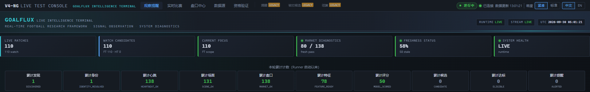
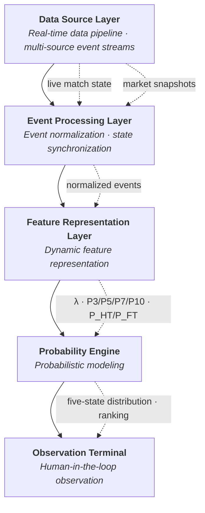
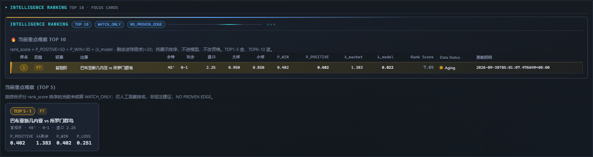
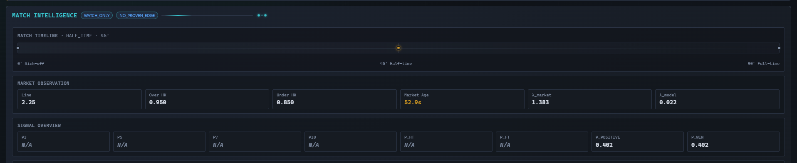
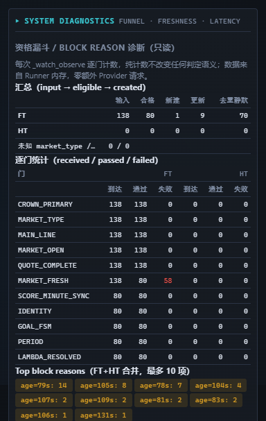
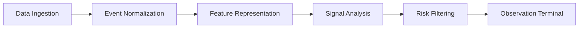
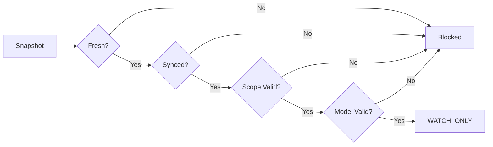

<p align="center">
  
</p>

<h1 align="center">GoalFlux</h1>

<p align="center">
  <b>Live Football Intelligence Engine</b>
</p>

<p align="center">
  <b>Real-time Data Ingestion</b> · <b>Event Normalization</b> · <b>Temporal Sequence Analysis</b> · <b>Probability Modeling</b> · <b>Risk-aware Filtering</b> · <b>Observation Terminal</b>
</p>

<p align="center">
  Created by <b>随心笔记</b>
</p>

<p align="center">
  
  
  
  
  
</p>

<p align="center">
  <sub>Bilingual documentation: <a href="./README.md">README.md (中文 / English)</a> · Runtime guide: <a href="./docs/RUNNING_GUIDE.md">docs/RUNNING_GUIDE.md</a></sub>
</p>

---

## Dashboard Preview

<p align="center">
  
</p>

<p align="center"><sub>GoalFlux Intelligence Terminal · Real-time observation dashboard · PUBLIC DEMO MODE</sub></p>

---

## Table of Contents

- [Architecture Pipeline](#architecture-pipeline)
- [Interface Preview](#interface-preview)
- [Project Overview](#project-overview)
- [Key Capabilities](#key-capabilities)
- [Core Modules](#core-modules)
- [Technical Foundation](#technical-foundation)
- [Remaining Goals Engine](#remaining-goals-engine)
- [Asian Total Settlement Logic](#asian-total-settlement-logic)
- [Probability Semantics](#probability-semantics)
- [WATCH_ONLY Observation Mode](#watch_only-observation_mode)
- [Ranking](#ranking)
- [Independent FT / HT Pipelines](#independent-ft--ht-pipelines)
- [Fail-Closed Safety](#fail-closed-safety)
- [Technical Principles](#technical-principles)
- [Project Status](#project-status)
- [Roadmap](#roadmap)
- [Author](#author)
- [Disclaimer](#disclaimer)
- [License](#license)

---

## Architecture Pipeline

GoalFlux runs a five-layer real-time pipeline from multi-source event streams to a human observation terminal:



- **Data Source → Processing**：multi-source event ingestion, cross-source event normalization, identity verification, score and minute synchronization
- **Processing → Feature**：normalized events drive dynamic feature representation (remaining-goals λ, Poisson distribution, P3/P5/P7/P10, P_HT/P_FT)
- **Feature → Signal Analysis**：five-state settlement probabilities, short-window goal probabilities, composite scoring and risk-aware filtering
- **Signal Analysis → Terminal**：WATCH_ONLY terminal, dynamic ranking, diagnostics panels and human judgment

> The public repository uses neutral names such as `Live Match Stream`, `Primary Asian Total Market`, and `Market Provider`. Real provider names, endpoint addresses, and collection implementations are not included.

---

## Interface Preview

### Dashboard

<p align="center">
  
</p>

<p align="center">
  <sub>Real-time observation dashboard</sub><br/>
  <sub>Hero system bar (Runtime / Stream / UTC) · six status cards · eligibility funnel · four-panel dashboard layout</sub>
</p>

### Intelligence Ranking

<p align="center">
  
</p>

<p align="center">
  <sub>Dynamic ranking visualization</sub><br/>
  <sub>TOP 10 · Rank · Watch Score · Data Status · persistent WATCH_ONLY / NO_PROVEN_EDGE markers</sub>
</p>

### Match Intelligence

<p align="center">
  
</p>

<p align="center">
  <sub>Match state analysis interface</sub><br/>
  <sub>Timeline · Market Observation · Signal Overview · State Visualization — observation metrics, not a prediction guarantee</sub>
</p>

### System Diagnostics

<p align="center">
  
</p>

<p align="center">
  <sub>System health monitoring</sub><br/>
  <sub>Freshness · Latency · Runtime Status · Data Health — live eligibility funnel, market-age distribution and latency profile</sub>
</p>

> All screenshots are sanitized: no local paths, credentials, endpoint URLs, real provider names, or raw data identifiers.
> The public release is positioned as a Research / Intelligence Framework and never shows win/loss statistics, hit rates, profit/loss, or outcome results.

---

## Project Overview

GoalFlux is a **multi-source data fusion and intelligent analysis research framework** for real-time football scenarios.

It combines live match state, Asian Total market observations, remaining-goals distributions, and five-state settlement models into a unified data chain, providing a WATCH_ONLY human observation terminal for FT (full-time) and HT (half-time) scopes.

Following modern real-time intelligence system design, GoalFlux combines multi-source data fusion, dynamic feature engineering, temporal sequence analysis, and probability modeling into a data-driven research framework for complex dynamic environments.

> GoalFlux is positioned as a **Research / Intelligence Framework**.
> Unproven probabilistic differences are not presented as a validated edge, and official automated signals remain disabled.

### Technical Directions

| Domain | Focus |
|---|---|
| Real-time Data Ingestion | Multi-source streaming ingestion of identity / state / market events |
| Event Normalization | Cross-source normalization, identity verification, score/minute sync |
| Feature Representation | Remaining-goals λ, Poisson features, P3/P5/P7/P10, P_HT/P_FT |
| Temporal Sequence Analysis | Match-state time-series modeling, dynamic goal-intensity tracking |
| Probability Modeling | Five-state settlement probabilities, short-window probabilities, composite scoring |
| Risk-aware Filtering | Freshness, scope, deduplication and probability-integrity gates |
| Observation Terminal | Explainable WATCH_ONLY interface, ranking and diagnostics |

---

## Key Capabilities

| Module | Capability |
|---|---|
| Remaining Goals | Remaining-goals intensity λ |
| Asian Total | Five-state Asian Total settlement |
| FT / HT | Independent full-time / half-time scopes |
| WATCH_ONLY | Observation-only alerts |
| Probability Windows | Goal probabilities for next 3 / 5 / 7 / 10 minutes |
| P_HT / P_FT | Goal-before-half-time / goal-before-full-time probabilities |
| Ranking | Dynamic Top 5 / Top 10 probability ranking |
| Safety | Fail-closed safety chain |
| Diagnostics | Runtime eligibility and latency diagnostics |

---

## Core Modules



| Module | Responsibility |
|---|---|
| **Data Ingestion** | Multi-source ingestion of raw identity / state / market events |
| **Event Normalization** | Cross-source normalization, identity verification, score/minute sync |
| **Feature Representation** | Remaining-goals λ, Poisson distribution, P3/P5/P7/P10, P_HT/P_FT derivation |
| **Signal Analysis** | Composite score (rank_score), dynamic Top 5 / Top 10 ranking |
| **Risk Filtering** | Fail-closed chain: freshness, scope, deduplication, probability integrity |
| **Observation Terminal** | WATCH_ONLY interface, ranking and diagnostics panels |

See [docs/RUNNING_GUIDE.md](./docs/RUNNING_GUIDE.md) for the runtime guide.

---

## Technical Foundation

Every layer of GoalFlux is independently observable and verifiable.

| Stage | Responsibility |
|---|---|
| Real-time Data Ingestion | Multi-source event streams and raw event collection (identity / state / market) |
| Event Normalization | Cross-source normalization, identity verification, score/minute sync |
| Feature Representation | Remaining-goals λ, Poisson distribution, P3/P5/P7/P10, P_HT/P_FT derivation |
| Temporal Sequence Analysis | Match-state time-series modeling, dynamic goal-intensity tracking |
| Probability Modeling | Five-state settlement probabilities, short-window probabilities, composite scoring |
| Risk-aware Filtering | Fail-closed chain: freshness, scope, deduplication, probability integrity |
| Observation Terminal | WATCH_ONLY terminal, ranking, diagnostics and human judgment |

> Each layer consumes only upstream data and introduces no prediction guarantee. The probability modeling layer outputs distributions and likelihoods — not betting advice.

---

## Remaining Goals Engine

Given the current minute, score, and market line, the engine estimates the remaining-goals intensity λ from the current moment to the settlement horizon (FT or HT), then derives short-window probabilities (P3/P5/P7/P10) and goal-before-horizon probabilities (P_HT / P_FT) via a Poisson remaining-goals distribution.

---

## Asian Total Settlement Logic

> This section is a **mathematical module explanation** only. It shows how a line is mathematically split and settled; it presents no historical results, hit rates, or profit/loss statistics.

Asian Total lines split into two half-stakes, producing five settlement states:

| State | Meaning |
|---|---|
| WIN | Both half-stakes win |
| HALF_WIN | One wins, one pushes |
| PUSH | Both half-stakes push |
| HALF_LOSS | One loses, one pushes |
| LOSS | Both half-stakes lose |

Example: `Over 2.75 = 0.5 × Over 2.5 + 0.5 × Over 3.0`

- Final 4+ goals → **WIN**
- Final 3 goals → **HALF_WIN**
- Final ≤ 2 goals → **LOSS**

Mathematical settlement logic only — not betting advice.

---

## Probability Semantics

| Field | Meaning |
|---|---|
| P3 | At least one more goal within the next 3 minutes |
| P5 | At least one more goal within the next 5 minutes |
| P7 | At least one more goal within the next 7 minutes |
| P10 | At least one more goal within the next 10 minutes |
| P_HT | At least one more goal before half-time |
| P_FT | At least one more goal before full-time |
| P_POSITIVE | Probability of WIN + HALF_WIN for the current line |

> **P_POSITIVE ≠ P_HT ≠ P_FT**：P_POSITIVE uses the line-settlement frame, while P_HT / P_FT use the event frame ("will another goal occur"). The three are not interchangeable.

---

## WATCH_ONLY Observation Mode

WATCH_ONLY is the primary observation terminal. It:

- auto-selects matches that pass every safety gate;
- displays the current Asian Total line and observed odds;
- displays remaining-goals λ and the five-state settlement probability distribution;
- displays P_POSITIVE and short-window goal probabilities;
- provides a dynamic Top 5 / Top 10 ranking;
- exposes data completeness and update times.

The page persistently shows `WATCH_ONLY` and `NO PROVEN EDGE` markers to emphasize human observation only — not betting advice.

---

## Ranking

Composite ranking (display-only; does not enter the model and does not change eligibility or probabilities):

```text
rank_score = P_POSITIVE × 50 + P_WIN × 30 + lambda_gap × 20
lambda_gap = lambda_model - remaining_goals_needed
remaining_goals_needed = line - (home_score + away_score)
```

Ranking reasons:

- `HIGH_P_POSITIVE`：P_POSITIVE ≥ 0.6
- `LAMBDA_SURPLUS`：lambda_gap > 0.5
- `RECENT_UPDATE`：everything else

> Ranking indicates relative probability priority inside the observation pool, **not a betting recommendation**.
> Profit, return, or BEST BET style wording is intentionally absent from the interface.

---

## Independent FT / HT Pipelines

FT and HT are fully independent pipelines:

| Dimension | HT | FT |
|---|---|---|
| Market | FIRST_HALF_ASIAN_TOTAL | FULL_TIME_ASIAN_TOTAL |
| Settlement horizon | Half-time | Full-time |
| λ | Independent | Independent |
| Probabilities | Independent | Independent |
| Settlement | Independent | Independent |
| Deduplication | Independent key | Independent key |

---

## Fail-Closed Safety

A failure in any safety layer blocks the fixture from entering WATCH_ONLY:

- Market Freshness
- Score Synchronization
- Minute Synchronization
- Market Status
- Scope Validation
- Identity Validation
- Post-Goal Resynchronization
- Duplicate Protection
- Probability Integrity



The system is fail-closed: every gate must pass before observation.

---

## Technical Principles

- **Read-only first**：the terminal triggers no writes, places no orders, sends no official alerts.
- **Single source of truth**：ranking converges once at data entry and is recomputed on every refresh.
- **Fail-closed**：doubtful data quality blocks output rather than risking it.
- **Probability transparency**：every probability field has explicit semantics; P_POSITIVE is never confused with P_HT/P_FT.
- **Explainability**：output distributions and signal origins are traceable — no black-box claims.
- **No overclaim**：no validated edge is claimed; unvalidated differences are not packaged as one.
- **Research-oriented**：the public release focuses on architecture, real-time monitoring, ranking logic and data diagnostics — never settlement results or profit/loss statistics.

---

## Project Status

| Module | Status |
|---|---|
| Research Mode | ACTIVE |
| Real-time Event Fusion | ACTIVE |
| Feature Engineering | ACTIVE |
| Probability Engine | ACTIVE |
| Settlement Logic Engine | ACTIVE |
| FT / HT WATCH_ONLY | ACTIVE |
| Top Ranking | ACTIVE |
| System Diagnostics | ACTIVE |
| Official Production Alert | **DISABLED** |
| Proven Market Edge | **NOT CLAIMED** |

---

## Roadmap

- Continue long-running WATCH_ONLY observation
- Expand explainability of signals and features
- Improve temporal state modeling
- Improve HT market coverage
- Add exportable analytical reports
- Improve the mobile terminal

> No accuracy or profitability is promised.

---

## Author

**随心笔记**

Independent AI / Data System Research

**Focus:**

- Real-time sports intelligence
- Data engineering
- Machine learning applications

GoalFlux is an independent software engineering and data intelligence project designed and iterated by **随心笔记**, built around real-time probability modeling, event fusion, temporal sequence analysis, runtime data quality, and explainable observation workflows.

See [AUTHOR.md](./AUTHOR.md).

---

## Disclaimer

GoalFlux is for software engineering, probability modeling, data analysis, and research demonstration only. It does not guarantee prediction accuracy, financial return, or market advantage. WATCH_ONLY output is analytical observation, not financial or betting advice.

See [DISCLAIMER.md](./DISCLAIMER.md).

---

## License

This public repository is for demonstration purposes. **The public repository uses synthetic demonstration data. Production integration components are not included.**

See [LICENSE](./LICENSE).

---

<p align="center">
  <sub>Created by 随心笔记 · GoalFlux · Live Football Intelligence Engine · Research &amp; Watch-Only</sub>
</p>
