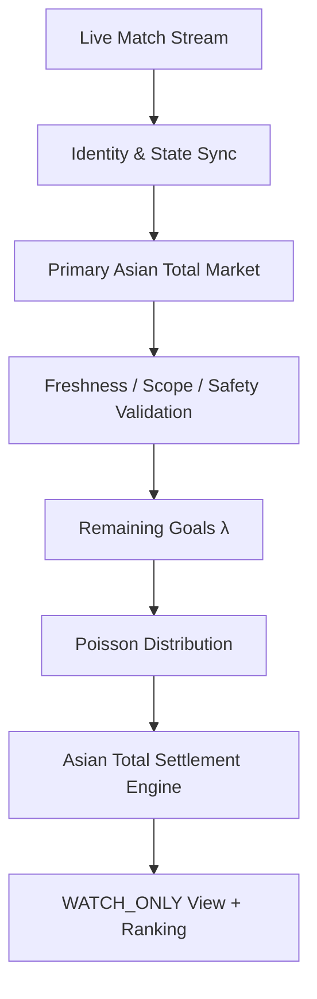

# 02 — Architecture / 架构

## 数据流

## 层级

| 层 | 职责 |
|---|---|
| Data Intake | 实时比赛流、主盘口快照（中性命名，不公开供应商） |
| State Sync | 身份校验、比分同步、分钟同步、进球后重同步 |
| Safety Gates | 新鲜度、范围、盘口状态、去重、概率完整性 |
| Probability | 剩余进球 λ、泊松分布、P3/P5/P7/P10、P_HT/P_FT |
| Settlement | 五态结算（WIN/HALF_WIN/PUSH/HALF_LOSS/LOSS） |
| Presentation | WATCH_ONLY 视图、Top 5/10 排名、诊断 |

## 设计原则

- **单一事实来源**：排名在数据入口收敛
- **只读展示**：界面不触发写入
- **Fail-Closed**：任一安全层失败即阻断
