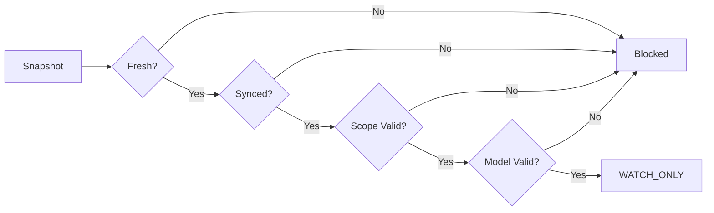

# 08 — Safety & Fail-Closed / 安全设计

## 安全层

任一安全层失败，该场比赛即被阻断，不进入 WATCH_ONLY。

| 安全层 | 说明 |
|---|---|
| Market Freshness | 盘口年龄在阈值内 |
| Score Sync | 比分与主源一致 |
| Minute Sync | 比赛分钟同步 |
| Market Status | 盘口处于可交易状态 |
| Scope Validation | FT / HT 范围合法 |
| Identity Validation | fixture 身份一致 |
| Post-Goal Resync | 进球后重新同步状态 |
| Duplicate Protection | 同 fixture + scope 不重复建记录 |
| Probability Integrity | 概率字段完整且在 [0,1] |

## 原则

- **Fail-Closed**：不确定时阻断，而非冒险输出
- **可审计**：每个阻断原因可追溯到具体 Gate
