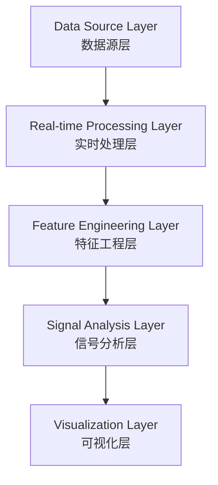

# GoalFlux Runtime Guide

> 本文档描述 GoalFlux 的运行架构、启动步骤与界面导览。
> 公开仓库使用合成演示数据，不包含生产数据管线。

---

## 1. Project Overview / 项目概述

**GoalFlux** 是一个面向实时足球场景的多源数据融合与智能分析框架。

系统将实时比赛状态、亚洲大小球市场、剩余进球分布与五态结算模型组织为统一数据链，为 FT（全场）/ HT（半场）场景提供 WATCH_ONLY 人工观察界面。

GoalFlux 采用现代实时智能系统设计理念，结合多源数据融合、动态特征工程、时序分析和概率建模方法，构建面向复杂动态环境的数据驱动研究框架。

**定位**：Research / Intelligence Framework — 不是投注工具，不提供预测保证。

---

## 2. Architecture / 架构



| Layer | 职责 |
|---|---|
| Data Source | 多源实时数据接入（比赛状态、市场快照） |
| Real-time Processing | 事件归一化、状态同步、身份校验 |
| Feature Engineering | 剩余进球 λ、Poisson 分布、P3/P5/P7/P10、P_HT/P_FT |
| Signal Analysis | 概率建模、五态结算、Top 排名、风险过滤 |
| Visualization | WATCH_ONLY 观察界面、诊断面板 |

> 公开版本不包含真实数据供应商名称、接口地址、采集代码。

---

## 3. Environment / 运行环境

| Item | Requirement |
|---|---|
| OS | Windows / Linux / macOS |
| Runtime | Python 3.10+ |
| Browser | Chrome / Edge / Firefox（桌面优先） |
| Display | 1920×1080 或以上（移动端兼容） |

公开仓库不需要连接真实数据源即可浏览文档与演示数据。

---

## 4. Startup Guide / 启动步骤

> 以下为内部运行环境启动步骤。公开仓库不包含可运行的生产代码。

```bash
# 1. Start Backend（启动后端）
#    启动 V4-NG runner，初始化数据管线与安全 Gate

# 2. Start Console（启动控制台）
#    控制台服务在 localhost:5080 提供前端界面与只读 API

# 3. Open Dashboard（打开仪表盘）
#    浏览器访问 http://localhost:5080
```

启动后，前端通过 GET-only API 消费已有接口，不新增影响业务的请求。

---

## 5. Interface Guide / 界面导览

### Live Watch — 实时观察页面

- 实时观察池中符合安全 Gate 的比赛列表
- 顶部状态卡：Live Matches / Watch Candidates / System Health / Freshness Status
- 每场比赛显示：比分、分钟、盘口、剩余进球 λ、五态概率、P_POSITIVE
- WATCH_ONLY / NO_PROVEN_EDGE 标记常驻

### Ranking — 动态排序展示

- **Top 5 / Top 10** 动态概率排名
- 排序列：Rank / Match / Minute / Score / Signals / Watch Score / Data Status
- Watch Score = rank_score（仅展示，不重算、不进模型）
- Top 5 金色高亮 / Top 6-10 蓝色高亮

### Diagnostics — 系统健康状态

- Market Freshness 诊断（passed / failed / age 分布）
- Latency 指标（state_age / heartbeat_lag / ui_lag，p50 / p95 / max）
- 数据状态灯（Fresh / Aging / Stale）
- Runtime Status（LIVE / SHADOW 模式）

---

## 6. Public Demo Mode / 公开演示模式

公开仓库使用 **合成演示数据**（Synthetic Demo Data），位于 `demo/` 目录。

- `demo/mock_watch_records.json` — 合成 WATCH_ONLY 观察记录
- `demo/mock_settlement_records.json` — 合成结算记录

> Production data pipelines are not included.
> 真实数据管线、采集接口、供应商映射均不在公开仓库中。

截图标注 `PUBLIC DEMO MODE`，已脱敏处理：无真实供应商名称、无接口 URL、无本机路径、无 Token/Key。

---

## 7. Current Status / 当前状态

| Item | Status |
|---|---|
| Mode | **Research Mode** |
| Observation | **WATCH_ONLY** |
| Official Alert | **Disabled** |
| Proven Edge | **Not Claimed** |

> GoalFlux 当前定位为研究与实时观察平台。
> 未经验证的概率差异不作为"已证明优势"呈现，正式自动化信号保持关闭。

---

## Safety Constraints / 安全约束

- Fail-Closed 安全链：9 层 Gate（Market Freshness / Score Sync / Minute Sync / Market Status / Scope Validation / Identity Validation / Post-Goal Resync / Duplicate Protection / Probability Integrity）
- 任何一层未通过 → 比赛从观察池移除
- 公开版本只展示系统思想与工程能力，不公开真实数据获取链
